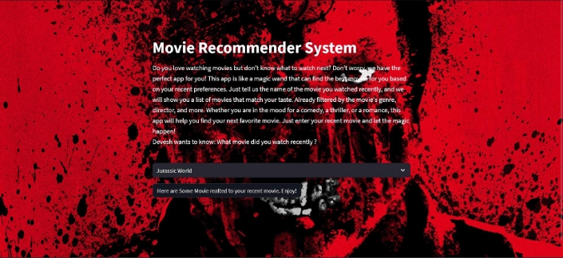
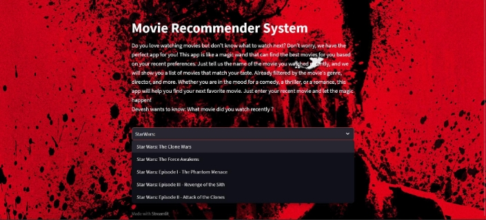
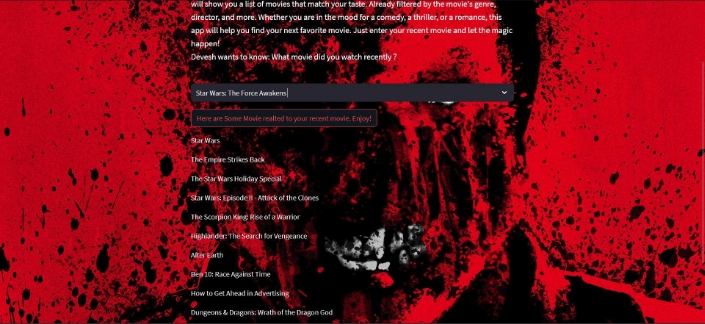

**Movie Recommendation System**

This is a web application that recommends movies based on the content of the movies. It uses a content-based approach to find movies that are similar to the movie that the user likes. The app is deployed using Streamlit Cloud Community and can be accessed[ here.](https://www.bing.com/%5E1%5E) 

**Dataset** 

The app uses the[ TMDB 10000 Movie Dataset f](https://www.bing.com/%5E2%5E)rom Kaggle, which contains information about 10,000 Hollywood movies, such as title, genres, cast, crew, keywords, overview, etc. The dataset is stored in a CSV file and can be downloaded from[ this link.](https://www.bing.com/%5E3%5E) 

**Methodology** 

The app uses the following steps to generate movie recommendations: 

- Preprocess the dataset and extract relevant features, such as genres, cast, crew, keywords, etc. 
  - Compute the cosine similarity between the movies based on these features. 
- For a given movie title, find the 10 most similar movies based on the cosine similarity scores. 
  - Display the titles and posters of the recommended movies on the web app. 

**Web App Interface** 

The web app has three main sections: 

- The initial page, which shows a welcome message and a brief introduction of the app. 

- The search movies section, which allows the user to enter a movie title and click on the “Here are Some Movie realted to your recent movie. Enjoy!” button to find recommendations. 

 

- The result section, which shows the 10 recommended movies along with their posters and a link to their IMDB page. 

The user gets the recommended movies filtered by genre and many other aspects. 

**References** 

- https://movie-recommendations-system-devesh.streamlit.app/  
- https://www.kaggle.com/tmdb/tmdb-movie-metadata  
- https://www.kaggle.com/tmdb/tmdb-movie-metadata/download 

